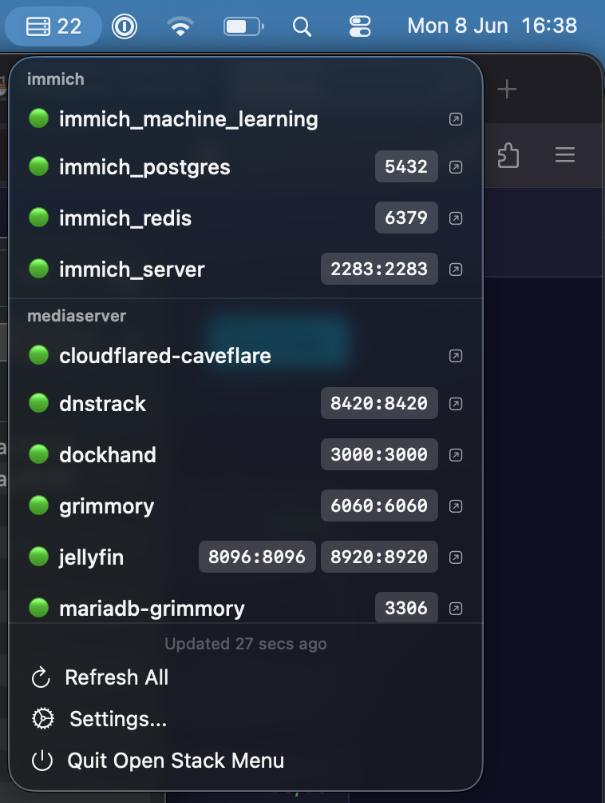

<p align="center">
  <h1 align="center">Open Stack Menu</h1>
  <p align="center">
    A macOS menu bar app to monitor your Docker containers at a glance.
  </p>
</p>

<p align="center">
  
</p>

<p align="center">
  <a href="https://swiftpackageindex.com/joe/open-stack-menu">
    
  </a>
  <a href="https://github.com/joe/open-stack-menu/blob/main/LICENSE">
    
  </a>
  
  
</p>

---


## Features

- [x] **Menu bar monitoring** — Live status of all Docker containers across multiple servers
- [x] **Multi-server support** — Monitor any number of remote Docker hosts via SSH
- [x] **HTTP health checks** — Per-container health endpoint polling with degraded state
- [x] **Color-coded status** — Green (online), red (offline), orange (degraded)
- [x] **Compose grouping** — Containers grouped by Docker Compose project
- [x] **Per-container overrides** — Custom URLs, display names, and health check paths
- [x] **SSH authentication** — Key-based (ssh-agent / 1Password) and password-based (Keychain)
- [x] **Launch at login** — Auto-start via macOS ServiceManagement
- [x] **Zero dependencies** — Built entirely with Apple system frameworks

## Requirements

- macOS 14.0+
- Swift 6.3+ (to build from source)
- Remote servers running Docker with SSH access

## Installation

### Build from source

No Xcode required — uses `swift build` + manual `.app` bundle assembly.

```sh
git clone https://github.com/joe/open-stack-menu.git
cd open-stack-menu
make build    # Release build
make run      # Launch the app
make install  # Install to /Applications
```

## Configuration

Config lives at `~/Library/Application Support/OpenStackMenu/config.json` and is human-editable JSON. A default config is created on first launch.

Add your servers in Settings, or edit the config directly:

```json
{
  "checkInterval": 60,
  "servers": [
    {
      "name": "Home Server",
      "host": "192.168.1.100",
      "port": 22,
      "username": "admin",
      "enabled": true
    }
  ]
}
```

## Contributing

Contributions are welcome! Feel free to open an issue or submit a pull request.

For development guidelines and architecture details, see [AGENTS.md](AGENTS.md).

## License

Open Stack Menu is available under the [MIT License](LICENSE).
